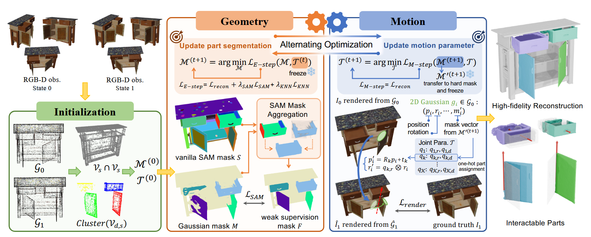

# GEAR: GEometry-motion Alternating Refinement for Articulated Object Modeling with Gaussian Splatting

[-blue.svg)]()

This is the official code repository for our paper **GEAR: GEometry-motion Alternating Refinement for Articulated Object Modeling with Gaussian Splatting**, accepted at **CVPR 2026 (Findings)**.

## Method Overview

<p align="center">
  
</p>

## Demo

<!-- <p align="center">
  <video controls width="100%">
    <source src="assets/videos/demo.mp4" type="video/mp4">
    Your browser does not support the video tag.
  </video>
</p> -->


## Environment setup

We recommend **Python 3.10** on Linux with an **NVIDIA GPU** and a **CUDA** stack that matches your PyTorch build.

1. **PyTorch** — Install `torch` and `torchvision` for your CUDA version from the [official install guide](https://pytorch.org/get-started/locally/) *before* installing other dependencies.

2. **Python dependencies** — From the repository root:
   ```bash
   pip install -r requirements.txt
   ```
   The file includes [Segment Anything](https://github.com/facebookresearch/segment-anything) via Git; `pip` needs network access to GitHub.

3. **GS extensions (required)** — After PyTorch is installed, build and install the local packages (still from the repo root):
   ```bash
   pip install ./submodules/simple-knn
   pip install ./submodules/diff-surfel-rasterization
   pip install ./utils/pointnet_lib
   ```
   If you use Git submodules, initialize `simple-knn` first, for example:
   ```bash
   git submodule update --init submodules/simple-knn
   ```

4. **SAM checkpoint** — Mask extraction (`utils/get_mask.py`, stage 1) expects the **ViT-H** weights at:
   ```
   submodules/sam_vit_h_4b8939.pth
   ```
   Download (example):
   ```bash
   wget -O submodules/sam_vit_h_4b8939.pth \
     https://dl.fbaipublicfiles.com/segment_anything/sam_vit_h_4b8939.pth
   ```
   You can override the path with `--sam_checkpoint` when running `utils/get_mask.py`.

5. **PyTorch3D** and **tiny-cuda-nn** — If installation fails, see [PyTorch3D install](https://github.com/facebookresearch/pytorch3d/blob/main/INSTALL.md) and the [tiny-cuda-nn](https://github.com/NVlabs/tiny-cuda-nn) build notes (CUDA toolkit / `nvcc` required for extensions).

## Dataset

We introduce the **GEAR_Multi** dataset for articulated object modeling. 
You can download the dataset from Google Drive here:
👉 [**Download GEAR_Multi Dataset**](https://drive.google.com/file/d/1nSQbpZPIgJ6q_2PW8Pz60nzT7trRnPQp/view?usp=sharing)

## Code Structure & Usage

The pipeline is primarily divided into five stages. We provide bash scripts in the `scripts/` directory to run each stage sequentially. Make sure to adjust the dataset paths and variables inside the scripts according to your local setup before running them.

### 1. Extract Masks
Extract 2D masks for the articulated object parts using SAM (Segment Anything Model) based on the initial images.
```bash
bash scripts/1_get_mask.sh
```

### 2. Coarse Optimization
Train a coarse Gaussian Splatting model to obtain a global geometry initialization.
```bash
bash scripts/2_coarse.sh
```

### 3. Voxelization and Dynamic Joint Extraction
Utilize the geometry from the coarse model to perform Top-K connected component voxelization. This step extracts dynamic joints and initializes their coarse poses.
```bash
bash scripts/3_voxelize.sh
```

### 4. Fine Training (GEAR)
Perform the Geometry-motion Alternating Refinement. This phase finely optimizes the joint parameters (axis, rotation, translation) alongside the 3D Gaussian attributes.
```bash
bash scripts/4_train.sh
```

### 5. Rendering & Evaluation
Render the novel views, visualize the part segmentation, and evaluate the resulting geometric and visual metrics.
```bash
bash scripts/5_render.sh
```

<!-- ## Citation

If you find our work or dataset useful, please consider citing:

```bibtex
@inproceedings{gear2026,
  title={GEAR: GEometry-motion Alternating Refinement for Articulated Object Modeling with Gaussian Splatting},
  author={Your Name and Co-authors},
  booktitle={Proceedings of the IEEE/CVF Conference on Computer Vision and Pattern Recognition (CVPR) Findings},
  year={2026}
}
``` -->
